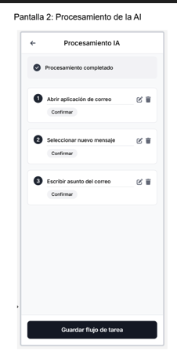
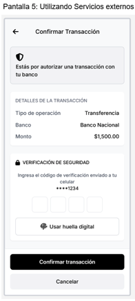
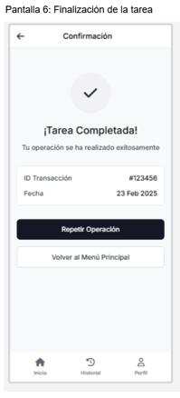

# Caso #1: Entregable 2

## App Asistant

1. Investigue como realizar un goal map en referencia a técnicas como google sprint o design thinking

Para realizar el Goal Map se uso Design Thinking, siguiendo estos pasos:

1. Define claramente tu objetivo principal desde la perspectiva del usuario.
2. Identifica actores clave (usuarios y asistentes) y colócalos a la izquierda del mapa.
3. Divide el objetivo en tareas específicas o subobjetivos (acciones que los actores deben realizar).
4. Crea un storyboard visual, mostrando claramente cómo cada tarea lleva hacia el objetivo principal.
5. Realiza un prototipo visual del Goal Map con conexiones claras entre actores, tareas y objetivo final.

Link de referencia: 
https://www.thefamiliar.tech/blog/2020-12-03-mapping-the-design-sprint-unpacked 

https://pxd.gd/strategy/goal-map 

https://youtu.be/JTqCR84fzeg?si=0GLf0LJMu5ZwWF8v

2. Proceda a crear un goal diagram ubicando el objetivo principal del sistema lo más a la derecha del diagrama y las entidades involucradas a la izquierda. Rellene el workflow del mapa y diagramelo en alguna herramienta que se lo permita.

 

3. Determine entonces usando ese mapa cuales son los estados que garantizan el éxito del sistema, aquellos puntos que son más valiosos para lograr el objetivo principal del sistema, los cuales van a hacer que el usuario acepte o no el uso de esta aplicación.

   - Registro y grabación de tareas

   - Creación de la lista de tareas

   - Ejecución de tareas

   - Entrenamiento de modela de IA con tareas grabadas

   - Conexión con entidades financieras y la confirmacion de transacciones

4. Una vez determinados los más importantes, listelos y proceda a diseñar las pantallas de su sistema que realizarían dichos flujos del mapa.

   - Grabación sencilla y precisa de tareas

   - Transcripción correcta de comandos de voz

   - Procesamiento eficiente mediante IA

   - Ejecución precisa y fluida de las tareas

   - Confirmación segura de transacciones

5. Diseñe los wireframes en blanco y negro de las pantallas necesarias para esos flujos prioridad #1 para el negocio.

 

 

 

6. Cree las pantallas a modo mockup o mimic.

La IA que se utilizó para crear estas pantallas fue Lovable, se utilizaron estas pantallas ya que fueron consideradas las mas importantes para que el uso de la aplicación fuera sencillo. 

7. Proceda a realizar un test de usabilidad con al menos 3 personas (que no sean estudiantes del Tec).

La herramienta que se utilizó para realizar el testing fue maze el cual generó estos resultados:

